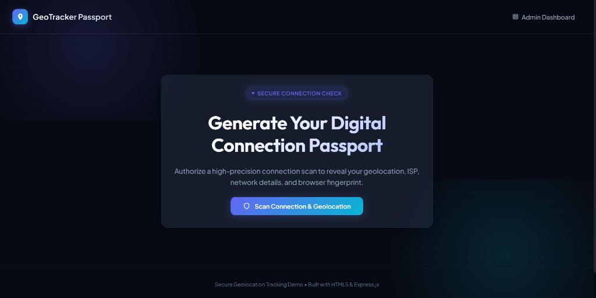
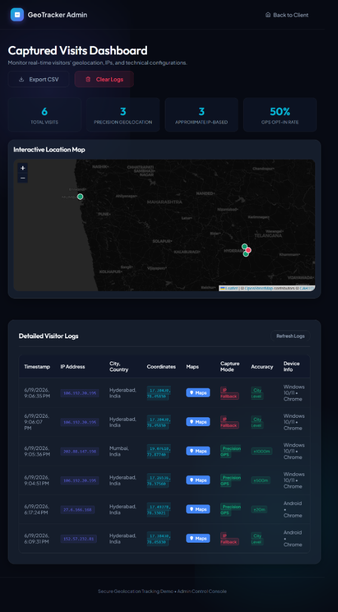

# 📍 GeoTracker

A modern **visitor geolocation tracking** web app. When someone opens your link, it captures their precise GPS location (if permitted) or falls back to IP-based location — all logged to a live admin dashboard with an interactive map.

**🌐 Live Demo:** [location-tracker-xi-six.vercel.app](https://location-tracker-xi-six.vercel.app)  
**🛡️ Admin Dashboard:** [location-tracker-xi-six.vercel.app/admin.html](https://location-tracker-xi-six.vercel.app/admin.html)

---

## ✨ Features

- 📍 **High-Precision GPS** — Uses browser's HTML5 Geolocation API for meter-level accuracy
- 🌐 **IP Fallback** — Automatically falls back to IP-based city-level location if GPS is denied
- 🗺️ **Interactive Admin Map** — Leaflet.js dark-theme map with pinned visitor locations
- 🔵 **Google Maps Integration** — Click any visit to open exact coordinates in Google Maps
- 📊 **Live Stats Dashboard** — Total visits, GPS opt-in rate, precision vs IP breakdown
- 📥 **CSV Export** — Download all visitor logs as a spreadsheet
- 🗑️ **Clear Logs** — One-click database wipe from admin panel
- 💾 **Persistent Storage** — Upstash Redis stores data permanently across deployments
- ⚡ **Serverless** — Runs entirely on Vercel serverless functions (zero server maintenance)
- 🎨 **Premium Dark UI** — Glassmorphism, micro-animations, Google Fonts

---

## 🖼️ Screenshots

### Visitor Landing Page


### Admin Dashboard


---

## 🏗️ Tech Stack

| Layer | Technology |
|---|---|
| **Frontend** | Vanilla HTML, CSS, JavaScript |
| **Backend** | Vercel Serverless Functions (Node.js) |
| **Database** | Upstash Redis (REST API) |
| **Map** | Leaflet.js + CartoDB Dark Matter tiles |
| **IP Geolocation** | ipapi.co (free tier) |
| **Hosting** | Vercel |

---

## 📁 Project Structure

```
GeoTracker/
├── api/
│   ├── visit.js        # POST /api/visit  — log a new visitor
│   └── visits.js       # GET/DELETE /api/visits — fetch or clear logs
├── public/
│   ├── index.html      # Visitor landing page
│   ├── admin.html      # Admin dashboard
│   ├── css/
│   │   └── style.css   # Global dark theme stylesheet
│   └── js/
│       ├── app.js      # Geolocation scan + passport UI logic
│       └── admin.js    # Map, table, stats, export logic
├── vercel.json         # Vercel deployment configuration
├── package.json        # Project metadata
├── .gitignore          # Excludes node_modules, .env, visits.json
└── .vercelignore       # Excludes local files from Vercel deploy
```

---

## 🚀 Deploy Your Own

### Prerequisites
- [Vercel account](https://vercel.com) (free)
- [Upstash account](https://upstash.com) (free Redis database)

### Steps

**1. Clone the repo**
```bash
git clone https://github.com/chakradhar2004/GeoTracker.git
cd GeoTracker
```

**2. Create an Upstash Redis database**
- Go to [console.upstash.com](https://console.upstash.com) → Create Database
- Copy your `UPSTASH_REDIS_REST_URL` and `UPSTASH_REDIS_REST_TOKEN`

**3. Deploy to Vercel**
```bash
npx vercel login
npx vercel --yes

# Add environment variables
echo "YOUR_UPSTASH_URL" | npx vercel env add UPSTASH_REDIS_REST_URL production
echo "YOUR_UPSTASH_TOKEN" | npx vercel env add UPSTASH_REDIS_REST_TOKEN production

# Deploy to production
npx vercel --prod --yes
```

**4. Done!** Share your Vercel URL with anyone to start tracking.

---

## 🔒 How Location Capture Works

```
Visitor opens link
       │
       ▼
Browser requests GPS permission
       │
  ┌────┴────┐
Allow       Deny
  │           │
  ▼           ▼
Precise    IP-based city
GPS coords  coordinates
(±meters)   (±km)
  │           │
  └────┬──────┘
       ▼
  Saved to Upstash Redis
       ▼
  Visible in Admin Dashboard
```

---

## ⚙️ API Reference

| Method | Endpoint | Description |
|---|---|---|
| `POST` | `/api/visit` | Log a new visitor (called by frontend) |
| `GET` | `/api/visits` | Return all stored visits |
| `DELETE` | `/api/visits` | Clear all visit logs |

---

## ⚠️ Privacy Notice

This tool captures visitor location data. Ensure you comply with applicable privacy laws (GDPR, etc.) before deploying publicly. Always inform users that their location is being collected.

---

## 📄 License

MIT License — feel free to use and modify.
